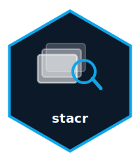

# stacr 

[](https://github.com/null-island-labs/stacr/actions/workflows/R-CMD-check.yaml)
[](https://CRAN.R-project.org/package=stacr)
[](https://lifecycle.r-lib.org/articles/stages.html#experimental)
[](https://app.codecov.io/gh/null-island-labs/stacr)

> Tidy STAC Workflows for R

Wraps the 'rstac' package with a pipe-friendly, tidy API. All results return tibbles instead of nested lists. Ships with a catalog registry of known STAC endpoints including Planetary Computer, Earth Search, and USGS, while supporting any STAC API URL.

## Installation

```r
# Install from CRAN (when available)
install.packages("stacr")

# Or install the development version from GitHub
# install.packages("pak")
pak::pak("null-island-labs/stacr")
```

## Quick Start

```r
library(stacr)

# Browse known STAC catalogs
stac_catalogs()
#> # A tibble: 3 × 3
#>   name               url                                              provider
#>   <chr>              <chr>                                            <chr>
#> 1 Earth Search       https://earth-search.aws.element84.com/v1       Element 84
#> 2 Planetary Computer https://planetarycomputer.microsoft.com/api/st…  Microsoft
#> 3 USGS               https://landsatlook.usgs.gov/stac-server        USGS

# Search for Sentinel-2 imagery
items <- stac_search(
  url = "https://earth-search.aws.element84.com/v1",
  collections = "sentinel-2-l2a",
  bbox = c(-84.5, 38.0, -84.3, 38.2),
  limit = 5
)
items
#> # A tibble: 5 × 6
#>   id                       collection     datetime           bbox  geometry assets
#>   <chr>                    <chr>          <chr>              <list> <list>  <list>
#> 1 S2B_16SGH_20260304_0_L2A sentinel-2-l2a 2026-03-04T16:32… <dbl>  <named> <chr>
#> …
```

## Features

| Function | Description |
|---|---|
| `stac_catalogs()` | Browse known STAC endpoints (offline) |
| `stac_collections()` | List collections from any STAC API |
| `stac_search()` | Search for items by collection, bbox, datetime |
| `stac_items()` | List items in a specific collection |
| `stac_download()` | Download assets to local files |
| `stac_to_cube()` | Bridge to gdalcubes for raster analysis |
| `stac_map()` | Interactive leaflet map of item footprints |

## License

MIT

## Author

**Chris Lyons** — [Null Island Labs](https://github.com/null-island-labs)

---

<sub>Part of the [Null Island Labs](https://github.com/null-island-labs) geospatial toolkit</sub>
